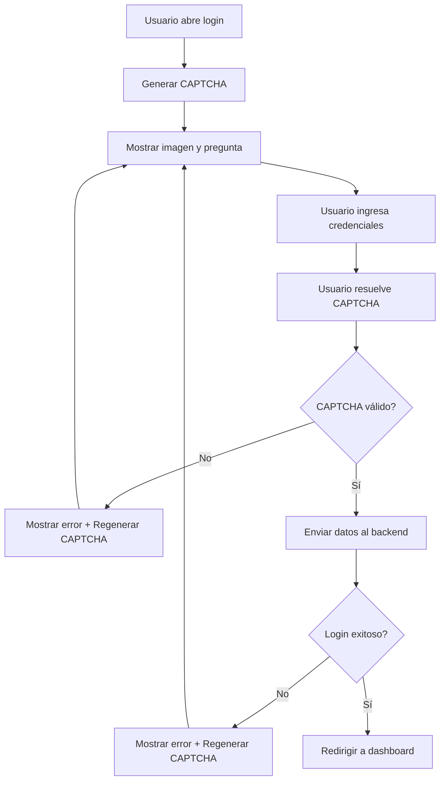

# 🤖 Integración CAPTCHA - Frontend

## 📋 Resumen de la Implementación

Se ha integrado exitosamente el sistema CAPTCHA en el frontend de React con las siguientes características:

✅ **Componente CAPTCHA reutilizable**  
✅ **Hook personalizado `useCaptcha`**  
✅ **Servicio de API integrado**  
✅ **Validación en tiempo real**  
✅ **Interfaz de usuario atractiva**  
✅ **Regeneración automática de CAPTCHA**  
✅ **Integración completa con el formulario de login**  

---

## 🗂️ Archivos Creados/Modificados

### **Nuevos Archivos:**
- `src/services/captchaService.js` - Servicio para llamadas API de CAPTCHA
- `src/components/Login/CaptchaComponent.jsx` - Componente CAPTCHA reutilizable
- `src/components/Login/FormLoginWithHook.jsx` - Login alternativo usando hook
- `src/hooks/useCaptcha.js` - Hook personalizado para CAPTCHA
- `src/styles/Captcha.module.css` - Estilos para el CAPTCHA

### **Archivos Modificados:**
- `src/components/Login/FormLogin.jsx` - Login original con CAPTCHA integrado
- `src/services/userService.js` - Actualizado para soportar CAPTCHA en login

---

## 🚀 Uso Básico

### **1. Usando el Componente CAPTCHA**

```jsx
import CaptchaComponent from './components/Login/CaptchaComponent';

function LoginForm() {
    const [captchaData, setCaptchaData] = useState(null);
    const [captchaValidation, setCaptchaValidation] = useState({ isValid: false });

    const handleCaptchaChange = (data) => {
        setCaptchaData(data);
    };

    const handleValidationChange = (validation) => {
        setCaptchaValidation(validation);
    };

    return (
        <form>
            {/* ... otros campos ... */}
            
            <CaptchaComponent
                type="math"
                onCaptchaChange={handleCaptchaChange}
                onValidationChange={handleValidationChange}
            />
            
            <button 
                type="submit" 
                disabled={!captchaValidation.isValid}
            >
                Enviar
            </button>
        </form>
    );
}
```

### **2. Usando el Hook personalizado**

```jsx
import { useCaptchaLogin } from '../hooks/useCaptcha';

function LoginForm() {
    const {
        captchaData,
        userAnswer,
        isValid: captchaIsValid,
        generateCaptcha,
        setAnswer,
        loginWithCaptcha,
        loginError
    } = useCaptchaLogin();

    // Generar CAPTCHA al montar
    useEffect(() => {
        generateCaptcha();
    }, [generateCaptcha]);

    const handleLogin = async (email, password) => {
        try {
            await loginWithCaptcha(email, password, userService.loginUser);
            // Login exitoso
        } catch (error) {
            // Manejar error
        }
    };

    return (
        <div>
            {/* Mostrar CAPTCHA */}
            {captchaData && (
                
            )}
            
            <input 
                value={userAnswer}
                onChange={(e) => setAnswer(e.target.value)}
                placeholder="Respuesta del CAPTCHA"
            />
            
            {loginError && <div className="error">{loginError}</div>}
        </div>
    );
}
```

---

## 🔧 API del Servicio CAPTCHA

### **captchaService.js**

```javascript
import { captchaService } from '../services/captchaService';

// Generar CAPTCHA
const captcha = await captchaService.generateCaptcha('math');
// Retorna: { success: true, captcha: { captcha_id, image, question } }

// Validar CAPTCHA
const validation = await captchaService.validateCaptcha(captchaId, answer);
// Retorna: { success: true, valid: boolean, message: string }

// Obtener site key de reCAPTCHA
const siteKey = await captchaService.getRecaptchaSiteKey();
// Retorna: { success: true, site_key: string }
```

---

## 🎨 Props del Componente CaptchaComponent

| Prop | Tipo | Default | Descripción |
|------|------|---------|-------------|
| `onCaptchaChange` | `function` | - | Callback cuando cambian los datos del CAPTCHA |
| `onValidationChange` | `function` | - | Callback cuando cambia el estado de validación |
| `type` | `'math' \| 'text'` | `'math'` | Tipo de CAPTCHA a generar |
| `autoRefresh` | `boolean` | `false` | Si debe regenerarse automáticamente |
| `refreshInterval` | `number` | `300000` | Intervalo de auto-refresh en ms |

### **Callbacks:**

```javascript
// onCaptchaChange
function handleCaptchaChange(data) {
    // data contiene:
    // - captcha_id: string
    // - type: 'math' | 'text'  
    // - validateCaptcha: function
    // - regenerateCaptcha: function
    // - getCurrentAnswer: function
}

// onValidationChange  
function handleValidationChange(validation) {
    // validation contiene:
    // - isValid: boolean
    // - captcha_id: string
    // - answer: string
    // - message?: string
    // - error?: string
}
```

---

## 🎯 Hook useCaptcha API

### **Estados Disponibles:**
```javascript
const {
    // Estados del CAPTCHA
    captchaData,        // Datos del CAPTCHA actual
    userAnswer,         // Respuesta actual del usuario
    isLoading,          // Si está cargando un nuevo CAPTCHA
    isValidating,       // Si está validando la respuesta
    isValid,            // Si la respuesta es válida
    error,              // Error actual
    validationMessage,  // Mensaje de validación
    
    // Funciones
    generateCaptcha,    // Generar nuevo CAPTCHA
    validateCaptcha,    // Validar respuesta actual
    setAnswer,          // Cambiar respuesta del usuario
    reset,              // Reiniciar todo el estado
    getCaptchaCredentials, // Obtener datos para el backend
    
    // Propiedades computadas
    isReady,            // Si está listo para usar
    canSubmit,          // Si se puede enviar el formulario
    loginData           // Datos listos para login
} = useCaptcha(options);
```

### **Opciones del Hook:**
```javascript
const options = {
    type: 'math',           // Tipo de CAPTCHA
    autoValidate: false,    // Validar automáticamente
    onSuccess: (data) => {}, // Callback de éxito
    onError: (error, message) => {} // Callback de error
};
```

---

## 🎨 Estilos CSS

Los estilos están en `src/styles/Captcha.module.css` y incluyen:

- **Responsive design** para móviles
- **Animaciones** suaves para feedback
- **Estados visuales** (válido/inválido)
- **Efectos hover** para interactividad
- **Indicadores de carga** claros

### **Clases CSS Principales:**
```css
.captchaContainer     /* Contenedor principal */
.captchaImage        /* Imagen del CAPTCHA */
.captchaInput        /* Campo de respuesta */
.validInput          /* Estilo para respuesta válida */
.invalidInput        /* Estilo para respuesta inválida */
.refreshButton       /* Botón de regenerar */
.captchaLoading      /* Estado de carga */
.captchaError        /* Mensajes de error */
```

---

## 🛠️ Configuración y Personalización

### **Variables CSS Personalizables:**
```css
/* En tu CSS global o componente */
.captchaContainer {
    --captcha-primary-color: #007bff;
    --captcha-success-color: #28a745;
    --captcha-error-color: #dc3545;
    --captcha-border-radius: 8px;
    --captcha-padding: 20px;
}
```

### **Personalizar el Hook:**
```javascript
// Hook personalizado para tu aplicación
export const useAppCaptcha = () => {
    return useCaptcha({
        type: 'math',
        autoValidate: true,
        onSuccess: (data) => {
            console.log('CAPTCHA válido:', data);
            // Analytics, logs, etc.
        },
        onError: (error, message) => {
            console.error('Error CAPTCHA:', message);
            // Manejo de errores personalizado
        }
    });
};
```

---

## 🔄 Flujo Completo de Login con CAPTCHA



---

## 🚦 Estados del Formulario de Login

### **Estados del Botón de Login:**
```javascript
// El botón se deshabilita cuando:
disabled={isLoading || !captchaIsValid}

// Estados visuales:
// 1. Normal: "Iniciar Sesión"
// 2. Cargando: "Iniciando sesión..."
// 3. Deshabilitado: Opacidad reducida
// 4. CAPTCHA inválido: No clickeable
```

### **Mensajes al Usuario:**
- ✅ **CAPTCHA correcto:** "✅ Correcto"
- ❌ **CAPTCHA incorrecto:** "❌ Incorrecto"  
- ⏳ **Validando:** "⏳ Validando..."
- 🔄 **Regenerando:** "⏳ Generando CAPTCHA..."
- ⚠️ **Error:** "Error al cargar CAPTCHA. Intenta de nuevo."

---

## 🧪 Testing

### **Test de Componente:**
```javascript
import { render, screen, fireEvent, waitFor } from '@testing-library/react';
import CaptchaComponent from './CaptchaComponent';

test('genera CAPTCHA al montar', async () => {
    render(<CaptchaComponent onCaptchaChange={jest.fn()} />);
    
    await waitFor(() => {
        expect(screen.getByAltText('CAPTCHA')).toBeInTheDocument();
    });
});

test('valida respuesta correcta', async () => {
    const onValidationChange = jest.fn();
    render(
        <CaptchaComponent 
            onCaptchaChange={jest.fn()}
            onValidationChange={onValidationChange}
        />
    );
    
    const input = screen.getByPlaceholderText('Ingresa tu respuesta');
    fireEvent.change(input, { target: { value: '10' } });
    fireEvent.blur(input);
    
    await waitFor(() => {
        expect(onValidationChange).toHaveBeenCalledWith(
            expect.objectContaining({ isValid: true })
        );
    });
});
```

### **Test de Hook:**
```javascript
import { renderHook, act } from '@testing-library/react';
import { useCaptcha } from './useCaptcha';

test('genera CAPTCHA correctamente', async () => {
    const { result } = renderHook(() => useCaptcha());
    
    await act(async () => {
        await result.current.generateCaptcha();
    });
    
    expect(result.current.captchaData).toBeDefined();
    expect(result.current.isReady).toBe(true);
});
```

---

## 🚀 Próximos Pasos y Mejoras

### **Funcionalidades Adicionales:**
1. **reCAPTCHA Integration** - Soporte completo para Google reCAPTCHA
2. **CAPTCHA de Audio** - Para accesibilidad
3. **Slider CAPTCHA** - Alternativa más moderna
4. **Rate Limiting Visual** - Mostrar límites al usuario
5. **Analytics** - Métricas de uso del CAPTCHA

### **Optimizaciones de Performance:**
1. **Lazy Loading** del componente CAPTCHA
2. **Caching** de imágenes CAPTCHA
3. **Debouncing** mejorado en validaciones
4. **Preload** del próximo CAPTCHA

### **Mejoras de UX:**
1. **Tooltips** explicativos
2. **Temas** claro/oscuro
3. **Animaciones** más suaves
4. **Indicadores de progreso** mejorados

---

## 📞 Soporte

Si tienes problemas con la implementación:

1. **Revisa la consola** del navegador para errores
2. **Verifica** que el backend esté ejecutándose en puerto 5000
3. **Confirma** que las rutas de CAPTCHA estén disponibles
4. **Prueba** los endpoints directamente con herramientas como Postman

### **Endpoints para Testing:**
```bash
# Generar CAPTCHA
POST http://localhost:5000/api/captcha/generate
Content-Type: application/json
{"type": "math"}

# Validar CAPTCHA  
POST http://localhost:5000/api/captcha/validate
Content-Type: application/json
{"captcha_id": "...", "answer": "..."}
```

---

## 🎉 **¡Sistema CAPTCHA Frontend Completamente Implementado!**

Tu frontend ahora tiene integración completa con el sistema CAPTCHA del backend, proporcionando:

✅ **Seguridad robusta** contra bots  
✅ **Experiencia de usuario fluida**  
✅ **Componentes reutilizables**  
✅ **Código mantenible y testeable**  
✅ **Diseño responsive y atractivo**  

¡El sistema está listo para producción! 🚀
